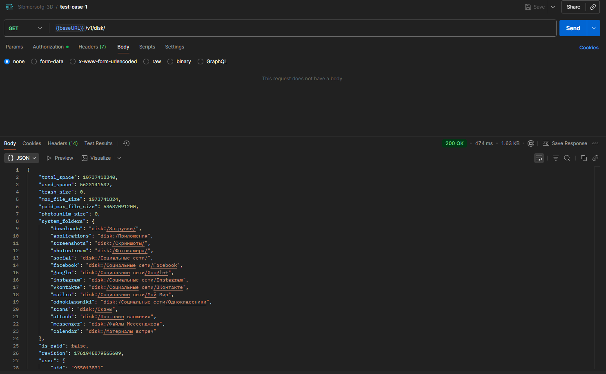
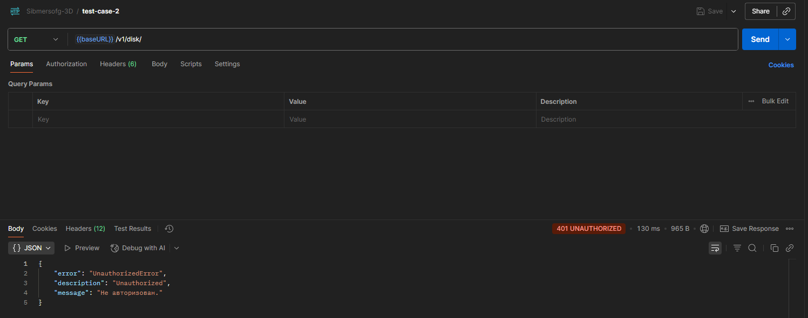
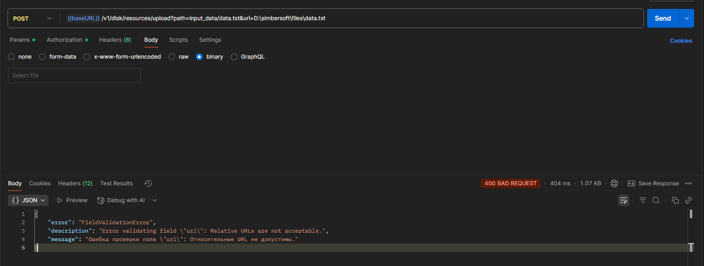
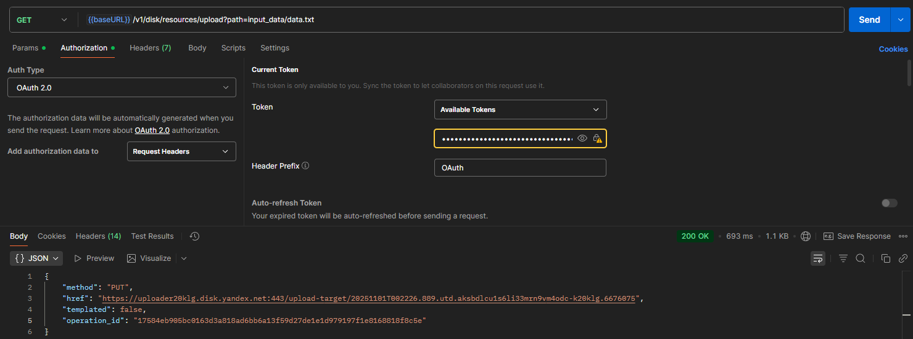
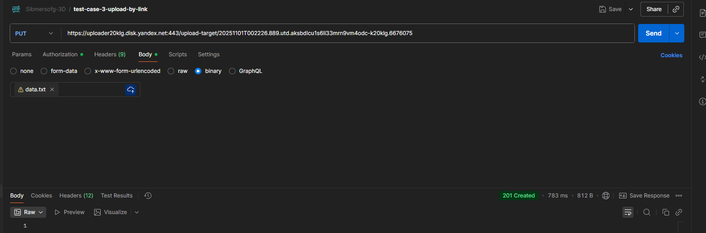
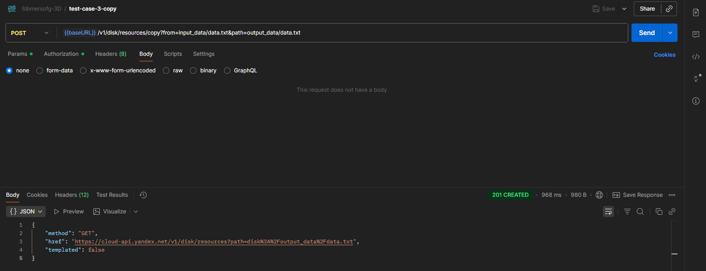
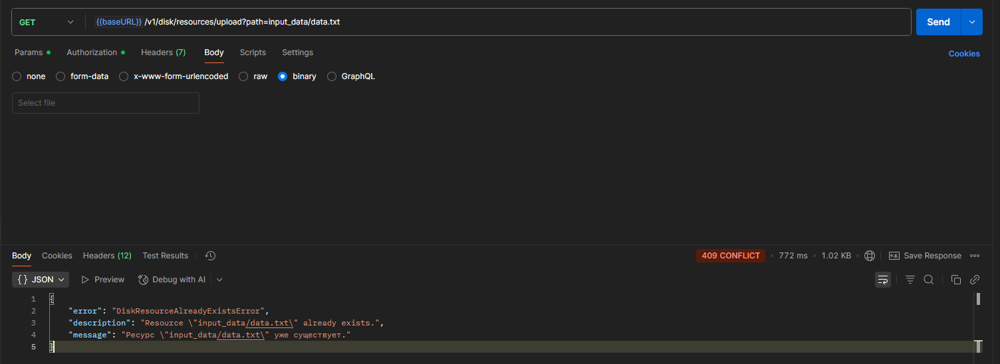
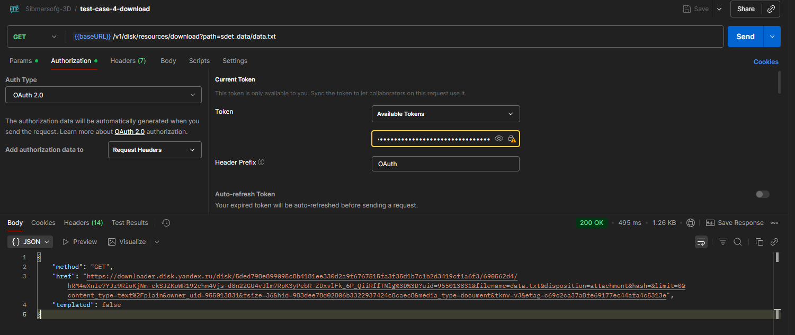

# Тест кейсы

## Тест-кейс №1. Авторизация с валидным токеном

Получил ожидаемый результат: 

## Тест-кейс №2. Авторизация без токена

Получил ожидаемый результат: 

## Тест-кейс №3. Загрузка и копирование файла

Ожидаемого результата по описанному тест-кейсу удалось 
Метода `PUT` на загрузку просто нет. 
При указании `POST` и переданным в параметрах запрос ссылку на локальный файл отдает ошибку: 
"Ошибка проверки поля \"url\": Относительные URL не допустимы.": 

 
Просто передать файл в теле запроса тоже не удалось.

В качестве альтернативы был рассмотрен вариант:
1. Получение ссылки на оплату: `GET` `/v1/disk/resources/upload`

2. Загрузка файла по полученной в первом шаге ссылке: `PUT`

3. Далее скопировать "data.txt" из "input_data" в "output_data" POST запросом по адресу /v1/disk/resources/copy

4. При повторной попытки получить ссылку по тому же пути получаем соответственную ошибку:

## Тест-кейс №4. Скачивание текстового файла
Получил ожидаемый результат, оба файла идентичны: 
